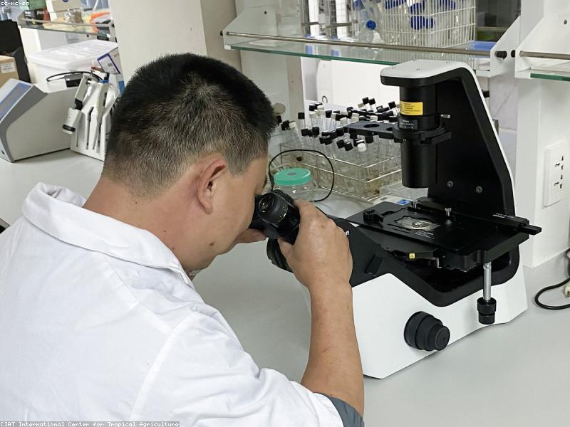
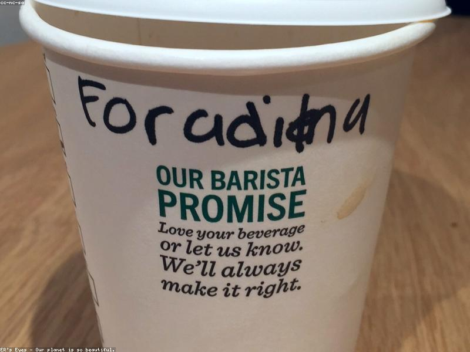
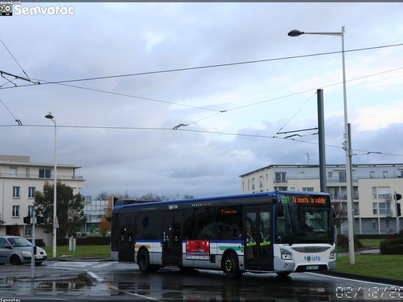
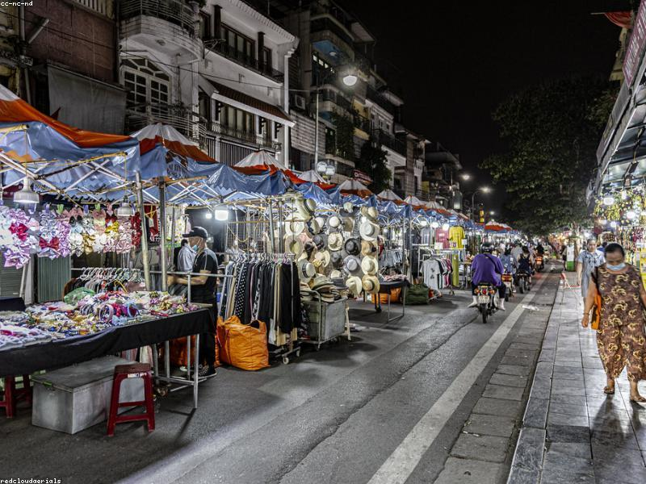
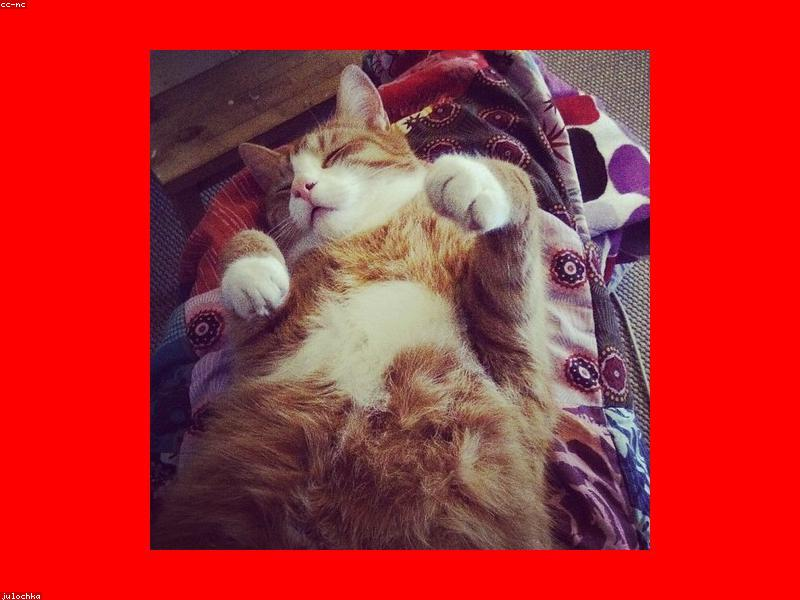
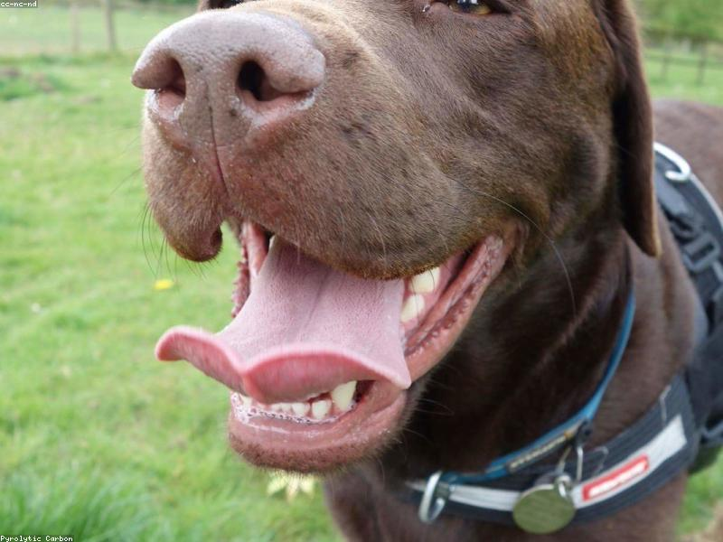
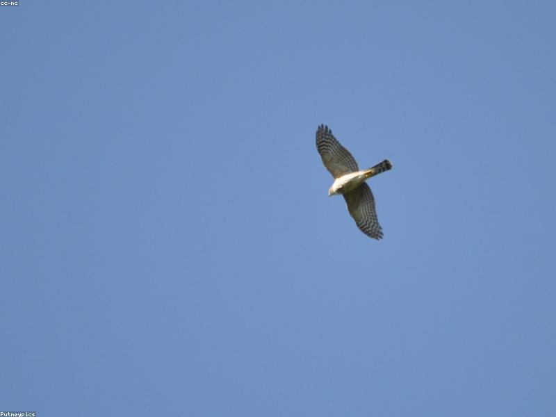

# Hướng dẫn Exercise 1: HTML/CSS

Tài liệu này hướng dẫn làm đầy đủ 11 câu trong đề `Exercise1 - HTML+CSS (Basic).pdf`.
Toàn bộ mã nguồn chỉ được trình bày trong file Markdown này. Các tên file như
`task1.html`, `task6.css` hoặc `task11.html` bên dưới là tên file mà đề bài yêu
cầu khi thực hành, không phải các file đã được tạo trong thư mục hiện tại.

## 1. Cách sử dụng tài liệu

Khi thực hành, tạo một thư mục riêng rồi chép từng khối code vào đúng tên file
được ghi phía trên khối code. Mở file HTML bằng trình duyệt và so sánh kết quả
với hình trong đề.

Một cấu trúc thư mục tham khảo:

```text
exercise1/
|-- task1.html
|-- task2.html
|-- ...
|-- task11.html
|-- task6.css
|-- task11.css
|-- category1.html
|-- category2.html
|-- category3.html
|-- about.html
`-- images/
    |-- photo1.jpg
    |-- photo2.jpg
    |-- photo3.jpg
    |-- nature1.jpg
    |-- nature2.jpg
    |-- nature3.jpg
    |-- city1.jpg
    |-- city2.jpg
    |-- city3.jpg
    |-- animal1.jpg
    |-- animal2.jpg
    `-- animal3.jpg
```

Các ảnh phải do người làm bài tự chọn. Với câu 3 và câu 4, mỗi ảnh gốc cần có
kích thước lớn hơn `300 x 300 px`.

## 2. Câu 1: Tiêu đề và đoạn văn

Yêu cầu chính là tạo một tiêu đề lớn và một đoạn văn giống hình mẫu. Thẻ `h1`
được dùng cho tiêu đề quan trọng nhất, còn `p` được dùng cho đoạn văn.

**File `task1.html`:**

```html
<!DOCTYPE html>
<html lang="en">
<head>
  <meta charset="UTF-8">
  <meta name="viewport" content="width=device-width, initial-scale=1.0">
  <title>Task 1</title>
</head>
<body>
  <h1>The Bachelor program is a important part of USTH.</h1>

  <p>
    It is applying the European Credit Transfer and Accumulation System (ECTS)
    as in most of European countries, with the study program corresponds to
    180 Credits in 3 years (60 Credits/year).
  </p>
</body>
</html>
```

Lưu ý: nội dung tiếng Anh được giữ giống hình mẫu của đề, kể cả cách dùng từ.

## 3. Câu 2: Danh sách có thứ tự và không có thứ tự

- `ol` tạo danh sách có thứ tự.
- `ul` tạo danh sách không có thứ tự.
- Mỗi phần tử trong danh sách được đặt trong thẻ `li`.

**File `task2.html`:**

```html
<!DOCTYPE html>
<html lang="en">
<head>
  <meta charset="UTF-8">
  <meta name="viewport" content="width=device-width, initial-scale=1.0">
  <title>Task 2</title>
</head>
<body>
  <h1>My favorite movies</h1>
  <ol>
    <li>Interstellar</li>
    <li>Inception</li>
    <li>Spirited Away</li>
  </ol>

  <h1>Subjects in this semester</h1>
  <ul>
    <li>Web Application Development</li>
    <li>Database Systems</li>
    <li>Computer Networks</li>
  </ul>
</body>
</html>
```

Có thể thay tên phim và môn học bằng thông tin thực tế của người làm bài.

## 4. Câu 3: Hiển thị ảnh thu nhỏ

Đặt ba ảnh có kích thước lớn hơn `300 x 300 px` trong thư mục `images`. Thuộc
tính `width="50"` và `height="50"` biến ảnh hiển thị thành thumbnail
`50 x 50 px` mà không làm thay đổi file ảnh gốc.

**File `task3.html`:**

```html
<!DOCTYPE html>
<html lang="en">
<head>
  <meta charset="UTF-8">
  <meta name="viewport" content="width=device-width, initial-scale=1.0">
  <title>Task 3</title>
</head>
<body>
  <h1>Image thumbnails</h1>

  
  
  
</body>
</html>
```

Nếu ảnh bị méo do tỉ lệ gốc không phải hình vuông, có thể dùng CSS sau trong
thẻ `head`:

```html
<style>
  img {
    width: 50px;
    height: 50px;
    object-fit: cover;
  }
</style>
```

## 5. Câu 4: Thumbnail liên kết đến ảnh đầy đủ

Bọc mỗi thẻ `img` bằng một thẻ `a`. Thuộc tính `href` của liên kết trỏ đến ảnh
gốc; `target="_blank"` mở ảnh đầy đủ trong tab hoặc cửa sổ mới.

**File `task4.html`:**

```html
<!DOCTYPE html>
<html lang="en">
<head>
  <meta charset="UTF-8">
  <meta name="viewport" content="width=device-width, initial-scale=1.0">
  <title>Task 4</title>
  <style>
    .thumbnail {
      width: 50px;
      height: 50px;
      object-fit: cover;
    }
  </style>
</head>
<body>
  <h1>Click a thumbnail to view the full-size image</h1>

  <a href="images/photo1.jpg" target="_blank">
    
  </a>

  <a href="images/photo2.jpg" target="_blank">
    
  </a>

  <a href="images/photo3.jpg" target="_blank">
    
  </a>
</body>
</html>
```

## 6. Câu 5: Bảng thời khóa biểu

Ô `Chemistry` chiếm cả buổi sáng và buổi chiều, vì vậy dùng `rowspan="2"`.
Các ô chưa có môn học vẫn cần được giữ lại bằng thẻ `td` rỗng để bảng đúng cột.

**File `task5.html`:**

```html
<!DOCTYPE html>
<html lang="en">
<head>
  <meta charset="UTF-8">
  <meta name="viewport" content="width=device-width, initial-scale=1.0">
  <title>Task 5</title>
  <style>
    table {
      border-collapse: collapse;
    }

    th,
    td {
      min-width: 110px;
      padding: 12px;
      border: 1px solid black;
      text-align: center;
    }
  </style>
</head>
<body>
  <table>
    <thead>
      <tr>
        <th></th>
        <th>Monday</th>
        <th>Tuesday</th>
        <th>Wednesday</th>
        <th>Thursday</th>
        <th>Friday</th>
      </tr>
    </thead>
    <tbody>
      <tr>
        <th>Morning</th>
        <td>Math</td>
        <td rowspan="2">Chemistry</td>
        <td>Mobile</td>
        <td></td>
        <td>History</td>
      </tr>
      <tr>
        <th>Afternoon</th>
        <td>Physics</td>
        <td></td>
        <td></td>
        <td></td>
      </tr>
    </tbody>
  </table>
</body>
</html>
```

## 7. Câu 6: Inline, embedded và external CSS

Câu này yêu cầu thể hiện ba cách dùng CSS:

1. **External CSS**: đặt quy tắc `#first-paragraph` trong `task6.css`.
2. **Embedded CSS**: đặt quy tắc `.red-text` trong thẻ `style` của HTML.
3. **Inline CSS**: đặt `style="color: red"` trực tiếp trên đoạn thứ ba.

Đoạn thứ nhất có kích thước `0.5em`, tức bằng một nửa kích thước chữ kế thừa
từ phần tử cha. Đề có cụm "0.5 of the normal font size", vì vậy giá trị đúng là
`0.5em`.

**Nội dung dự kiến của file `task6.css`:**

```css
#first-paragraph {
  font-size: 0.5em;
}
```

**File `task6.html`:**

```html
<!DOCTYPE html>
<html lang="en">
<head>
  <meta charset="UTF-8">
  <meta name="viewport" content="width=device-width, initial-scale=1.0">
  <title>Task 6</title>

  <!-- External CSS -->
  <link rel="stylesheet" href="task6.css">

  <!-- Embedded CSS -->
  <style>
    .red-text {
      color: red;
    }
  </style>
</head>
<body>
  <p id="first-paragraph">
    This is the first paragraph. Its font size is 0.5em.
  </p>

  <p class="red-text">
    This is the second paragraph. Its text is red.
  </p>

  <!-- Inline CSS -->
  <p style="color: red;">
    This is the third paragraph. Its text is also red.
  </p>
</body>
</html>
```

## 8. Câu 7: Viền ảnh và pseudo-class `:hover`

`border: 5px solid red` lần lượt mô tả độ dày, kiểu đường viền và màu. Bộ chọn
`.photo:hover` chỉ được áp dụng khi con trỏ chuột nằm trên ảnh.

**File `task7.html`:**

```html
<!DOCTYPE html>
<html lang="en">
<head>
  <meta charset="UTF-8">
  <meta name="viewport" content="width=device-width, initial-scale=1.0">
  <title>Task 7</title>
  <style>
    .photo {
      width: 300px;
      height: 300px;
      border: 5px solid red;
      object-fit: cover;
      transition: border-color 0.2s, opacity 0.2s;
    }

    .photo:hover {
      border-color: green;
      opacity: 0.75;
    }
  </style>
</head>
<body>
  
</body>
</html>
```

## 9. Câu 8: Trạng thái của liên kết

Thứ tự các pseudo-class cần được giữ là `:link`, `:visited`, `:hover` để trạng
thái rê chuột có thể ghi đè màu của liên kết đã truy cập.

**File `task8.html`:**

```html
<!DOCTYPE html>
<html lang="en">
<head>
  <meta charset="UTF-8">
  <meta name="viewport" content="width=device-width, initial-scale=1.0">
  <title>Task 8</title>
  <style>
    a {
      text-decoration: none;
    }

    a:link {
      color: blue;
    }

    a:visited {
      color: red;
    }

    a:hover {
      color: green;
    }
  </style>
</head>
<body>
  <nav>
    <a href="task1.html">Task 1</a> |
    <a href="task2.html">Task 2</a> |
    <a href="task3.html">Task 3</a>
  </nav>
</body>
</html>
```

## 10. Câu 9: Bảng có hiệu ứng highlight khi hover

Dùng `tbody tr:hover` để chỉ tô sáng các hàng dữ liệu. Hàng tiêu đề không bị
ảnh hưởng.

**File `task9.html`:**

```html
<!DOCTYPE html>
<html lang="en">
<head>
  <meta charset="UTF-8">
  <meta name="viewport" content="width=device-width, initial-scale=1.0">
  <title>Task 9</title>
  <style>
    table {
      width: 600px;
      border-collapse: collapse;
      font-family: Arial, sans-serif;
      text-align: center;
    }

    th,
    td {
      padding: 14px;
      border: 1px solid white;
    }

    thead {
      color: white;
      background-color: #28558a;
    }

    tbody tr:nth-child(odd) {
      background-color: #cbd5e5;
    }

    tbody tr:nth-child(even) {
      background-color: #e6ebf3;
    }

    tbody tr:hover {
      background-color: #ffe082;
    }
  </style>
</head>
<body>
  <table>
    <thead>
      <tr>
        <th>Subject</th>
        <th>ECTS</th>
      </tr>
    </thead>
    <tbody>
      <tr>
        <td>Math</td>
        <td>3</td>
      </tr>
      <tr>
        <td>Physics</td>
        <td>5</td>
      </tr>
      <tr>
        <td>Chemistry</td>
        <td>4</td>
      </tr>
      <tr>
        <td>English</td>
        <td>3</td>
      </tr>
    </tbody>
  </table>
</body>
</html>
```

## 11. Câu 10: Bố cục bằng các thẻ `div`

Hình mẫu gồm một vùng đầu trang màu xanh, một hàng nội dung có cột trái màu
xám và cột phải màu xanh lá nhạt, sau đó là vùng chân trang màu xanh. `display:
flex` giúp đặt hai cột cạnh nhau.

**File `task10.html`:**

```html
<!DOCTYPE html>
<html lang="en">
<head>
  <meta charset="UTF-8">
  <meta name="viewport" content="width=device-width, initial-scale=1.0">
  <title>Task 10</title>
  <style>
    * {
      box-sizing: border-box;
    }

    body {
      margin: 0;
      padding: 40px;
    }

    .layout {
      width: 700px;
      max-width: 100%;
      margin: 0 auto;
      border: 2px solid #315b91;
    }

    .header,
    .footer {
      height: 80px;
      background-color: #4a75c4;
    }

    .content-row {
      display: flex;
      min-height: 330px;
    }

    .sidebar {
      width: 27%;
      background-color: #dddddd;
      border-right: 2px solid #315b91;
    }

    .main-content {
      width: 73%;
      background-color: #c8e3b7;
    }
  </style>
</head>
<body>
  <div class="layout">
    <div class="header"></div>

    <div class="content-row">
      <div class="sidebar"></div>
      <div class="main-content"></div>
    </div>

    <div class="footer"></div>
  </div>
</body>
</html>
```

## 12. Câu 11: Website xem ảnh theo danh mục

### 12.1. Cách tổ chức

Giải pháp dưới đây chỉ dùng HTML và CSS:

- `task11.html` tạo banner, menu trái, khung nội dung phải và footer.
- Các liên kết danh mục dùng `target="photo-frame"` để mở trang tương ứng bên
  trong `iframe` ở khung bên phải.
- Mỗi thumbnail được bọc trong liên kết đến ảnh gốc và dùng `target="_blank"`
  để mở ảnh đầy đủ trong tab hoặc cửa sổ mới.
- Liên kết About mở `about.html`, trong đó có tên sinh viên.
- `task11.css` chứa CSS dùng chung cho trang chính và các trang trong `iframe`.

### 12.2. CSS dùng chung

**Nội dung dự kiến của file `task11.css`:**

```css
* {
  box-sizing: border-box;
}

body {
  margin: 0;
  font-family: Arial, sans-serif;
  color: #ffffff;
  background-color: #ffffff;
}

.site {
  width: 900px;
  max-width: calc(100% - 32px);
  margin: 20px auto;
}

.banner,
.footer {
  display: flex;
  align-items: center;
  justify-content: center;
  background-color: #5b9bd5;
}

.banner {
  height: 110px;
  margin-bottom: 16px;
  font-size: 24px;
}

.page-body {
  display: flex;
  gap: 16px;
  min-height: 500px;
}

.sidebar {
  flex: 0 0 210px;
  padding: 36px 18px;
  background-color: #5b9bd5;
}

.sidebar a {
  display: block;
  margin-bottom: 14px;
  padding: 12px;
  border: 1px solid #aec785;
  color: #ffffff;
  background-color: #548235;
  text-align: center;
  text-decoration: none;
}

.sidebar a:hover,
.sidebar a:focus {
  background-color: #385723;
}

.viewer {
  flex: 1;
  min-width: 0;
  background-color: #5b9bd5;
}

.viewer iframe {
  display: block;
  width: 100%;
  height: 500px;
  border: 0;
}

.footer {
  height: 55px;
  margin-top: 16px;
}

/* CSS cho category1.html, category2.html và category3.html */
.gallery-page {
  padding: 36px;
  background-color: #5b9bd5;
}

.gallery-page h1 {
  margin-top: 0;
  font-size: 24px;
}

.gallery {
  display: grid;
  grid-template-columns: repeat(3, minmax(100px, 1fr));
  gap: 16px;
}

.gallery img {
  display: block;
  width: 100%;
  aspect-ratio: 1;
  border: 2px solid #d9e6c5;
  object-fit: cover;
}

.gallery img:hover {
  border-color: #ffffff;
  opacity: 0.8;
}

.about-page {
  padding: 36px;
  color: #1f2937;
  background-color: #ffffff;
}

@media (max-width: 700px) {
  .page-body {
    flex-direction: column;
  }

  .sidebar {
    flex-basis: auto;
  }

  .gallery {
    grid-template-columns: repeat(2, minmax(90px, 1fr));
  }
}
```

### 12.3. Trang bố cục chính

**File `task11.html`:**

```html
<!DOCTYPE html>
<html lang="en">
<head>
  <meta charset="UTF-8">
  <meta name="viewport" content="width=device-width, initial-scale=1.0">
  <title>Photo Gallery</title>
  <link rel="stylesheet" href="task11.css">
</head>
<body>
  <div class="site">
    <header class="banner">Banner</header>

    <div class="page-body">
      <nav class="sidebar" aria-label="Photo categories">
        <a href="category1.html" target="photo-frame">Nature</a>
        <a href="category2.html" target="photo-frame">Cities</a>
        <a href="category3.html" target="photo-frame">Animals</a>
        <a href="about.html" target="photo-frame">About</a>
      </nav>

      <main class="viewer">
        <iframe
          src="category1.html"
          name="photo-frame"
          title="Photo gallery content"
        ></iframe>
      </main>
    </div>

    <footer class="footer">Copyright &copy; 2026</footer>
  </div>
</body>
</html>
```

### 12.4. Các trang danh mục

**File `category1.html`:**

```html
<!DOCTYPE html>
<html lang="en">
<head>
  <meta charset="UTF-8">
  <meta name="viewport" content="width=device-width, initial-scale=1.0">
  <title>Nature photos</title>
  <link rel="stylesheet" href="task11.css">
</head>
<body class="gallery-page">
  <h1>Nature</h1>
  <div class="gallery">
    <a href="images/nature1.jpg" target="_blank">
      
    </a>
    <a href="images/nature2.jpg" target="_blank">
      
    </a>
    <a href="images/nature3.jpg" target="_blank">
      
    </a>
  </div>
</body>
</html>
```

**File `category2.html`:**

```html
<!DOCTYPE html>
<html lang="en">
<head>
  <meta charset="UTF-8">
  <meta name="viewport" content="width=device-width, initial-scale=1.0">
  <title>City photos</title>
  <link rel="stylesheet" href="task11.css">
</head>
<body class="gallery-page">
  <h1>Cities</h1>
  <div class="gallery">
    <a href="images/city1.jpg" target="_blank">
      
    </a>
    <a href="images/city2.jpg" target="_blank">
      
    </a>
    <a href="images/city3.jpg" target="_blank">
      
    </a>
  </div>
</body>
</html>
```

**File `category3.html`:**

```html
<!DOCTYPE html>
<html lang="en">
<head>
  <meta charset="UTF-8">
  <meta name="viewport" content="width=device-width, initial-scale=1.0">
  <title>Animal photos</title>
  <link rel="stylesheet" href="task11.css">
</head>
<body class="gallery-page">
  <h1>Animals</h1>
  <div class="gallery">
    <a href="images/animal1.jpg" target="_blank">
      
    </a>
    <a href="images/animal2.jpg" target="_blank">
      
    </a>
    <a href="images/animal3.jpg" target="_blank">
      
    </a>
  </div>
</body>
</html>
```

### 12.5. Trang About

Thay nội dung `Nguyen Van A` và mã sinh viên bằng thông tin thật trước khi nộp.

**File `about.html`:**

```html
<!DOCTYPE html>
<html lang="en">
<head>
  <meta charset="UTF-8">
  <meta name="viewport" content="width=device-width, initial-scale=1.0">
  <title>About</title>
  <link rel="stylesheet" href="task11.css">
</head>
<body class="about-page">
  <h1>About</h1>
  <p>Student name: Nguyen Van A</p>
  <p>Student ID: BA12-000</p>
</body>
</html>
```

## 13. Checklist trước khi nộp bài

- Mỗi tài liệu HTML bắt đầu bằng `<!DOCTYPE html>`.
- Mọi thẻ mở đều có thẻ đóng phù hợp.
- Đường dẫn ảnh bắt đầu bằng `images/` và đúng cả tên lẫn phần mở rộng.
- Câu 3 hiển thị ảnh ở kích thước `50 x 50 px`.
- Câu 4 mở được ảnh gốc khi bấm thumbnail.
- Câu 5 dùng `rowspan="2"` cho môn Chemistry.
- Câu 6 thể hiện đủ inline, embedded và external CSS.
- Câu 7 đổi giao diện ảnh khi rê chuột.
- Câu 8 bỏ gạch chân, liên kết đã xem có màu đỏ và khi hover có màu xanh lá.
- Câu 9 tô sáng đúng hàng dữ liệu khi rê chuột.
- Câu 10 có đủ bốn vùng và từng vùng đều là một thẻ `div`.
- Câu 11 đổi được danh mục trong khung phải, mở được ảnh đầy đủ và hiển thị
  đúng thông tin sinh viên ở trang About.
- Mở DevTools của trình duyệt và kiểm tra thẻ Console không có lỗi tải file
  hoặc lỗi đường dẫn ảnh.

